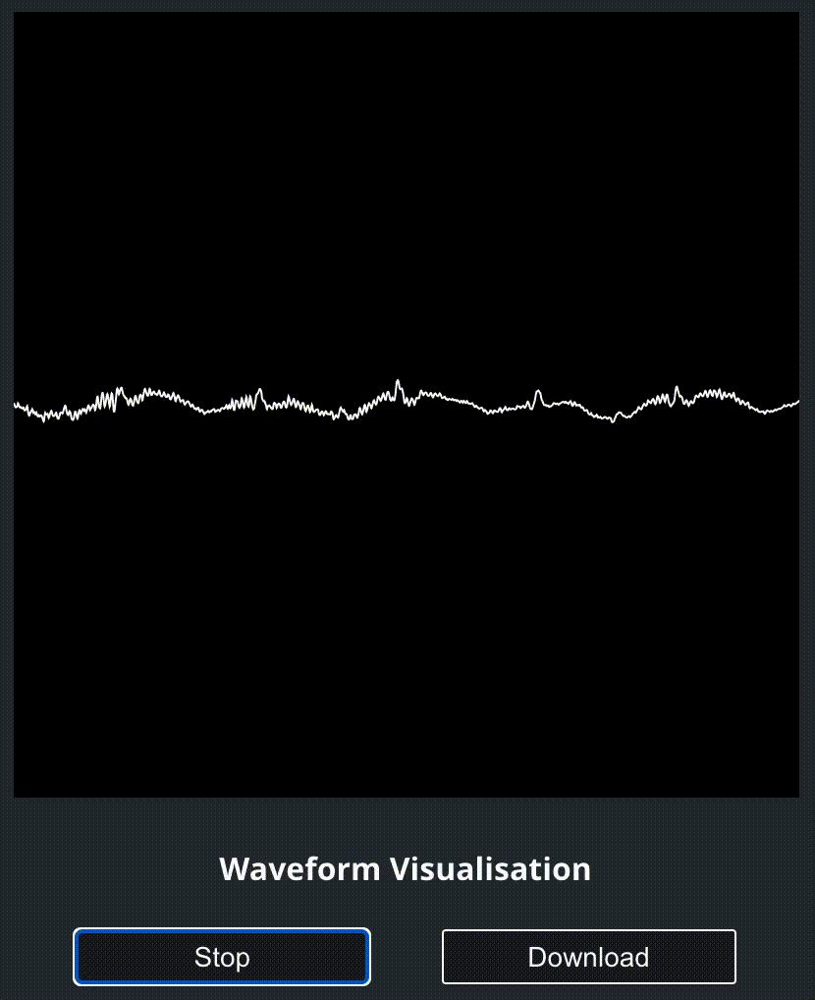
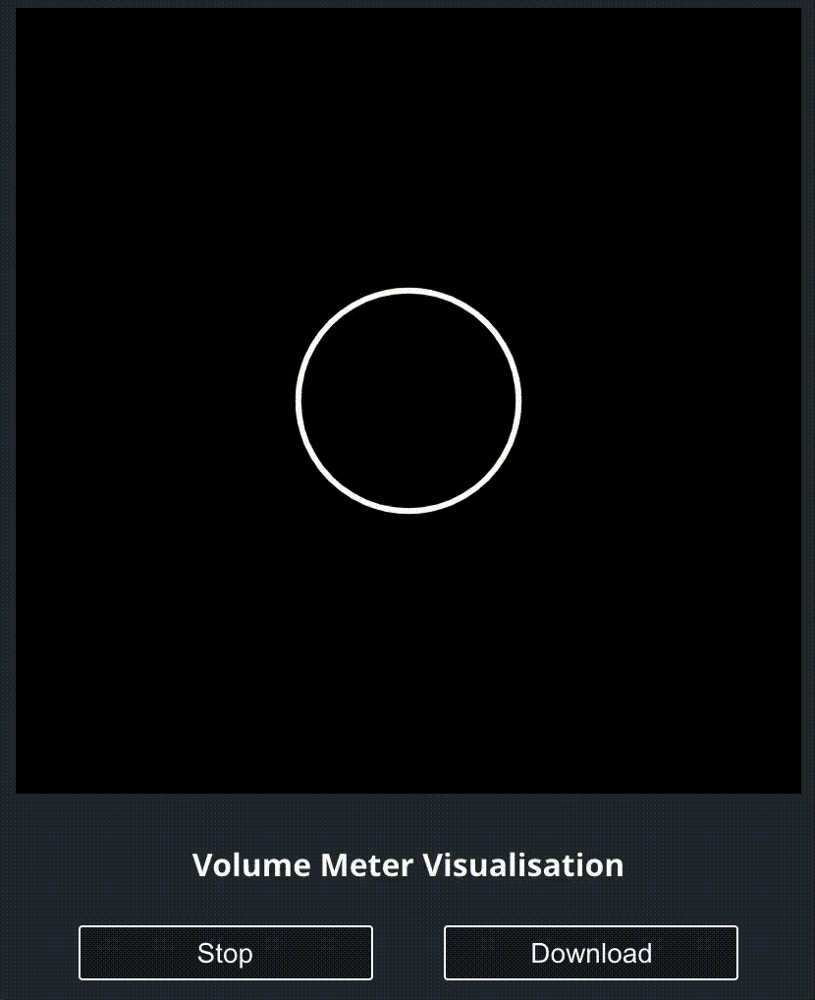
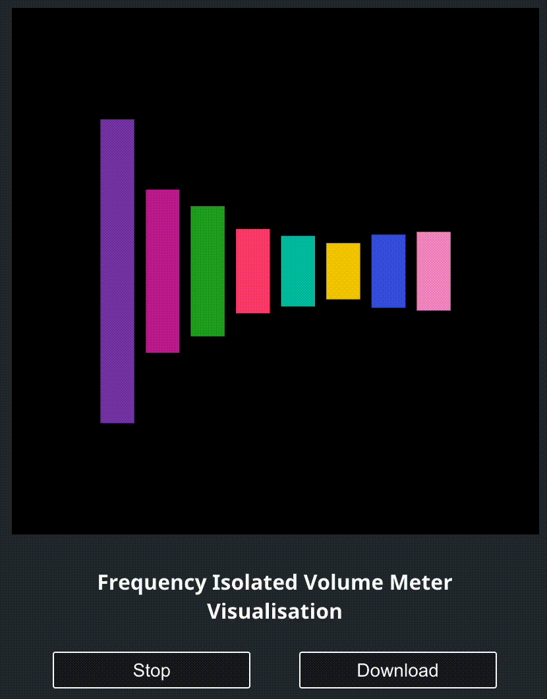

# Audio Visualiser Tool

This is a small proof of concept that I made while playing around with the Web Audio API. 

## Waveform Visualisation

- Our goal here is to create and display a waveform from a given audio.
- We can use `analyserNode.getFloatTimeDomainData` method to get a float 32 array of amplitude values. These values will be between -1 and +1.
- Then, we will convert each of these amplitude values to their corresponding y axis pixel position, and then draw that pixel point on the screen, which will ultimately form the waveform we want.
- To actually draw the graph on the screen, we will use [P5.js](https://p5js.org/).

## Volume Meter visualisation

- Here, we will create a visualisation based on the level of loudness of the audio that is being played.
- One simple visualisation this way is to have a circle, which changes its size based on the loudness (volume) level of the track, the louder the audio at a particular time is, the larger the circle will be, and vice versa.
- So for this, we’ll be needing the strength of the audio signal in a particular range (so that the circle can then change size accordingly).
- To get that, we will calculate the root mean squared value of a set of signals and use that as the radius of the circle, which we will then draw using P5.

## Volume Meter with isolated frequency bands

- In the previous visualisation, we simply used the overall loudness of the audio track. Here, we will measure & visualise the loudness of specific frequency bands inside the audio being played.
- In any audio, there might be certain sounds which are of high frequency, like a kickdrum or a guitar pluck, and others which are of lower frequency, like treble or cybil crash. What we are doing here, is separating those into different bands, and measuring the loudness of each band at one particular instance, and visualising it.
- With this visualisation, we will actually be able to see how the track is changing its form in terms of its frequency.
- To implement this, we will need one analyser for each frequency band we want to isolate. Then, for each analyser, we will pass the signal through a **biquad bandpass filter** to only allow that particular frequency band to pass through.
- Then, we will just pass it to the analyser and calculate the root mean squared value of the signal which will give us the strength of just one particular frequency band.